# FLUXOGRAMAS DO SISTEMA FACIC INTERATIVA
## Código Mermaid para Importação no Lucidchart

**Data:** 03/10/2025  
**Versão:** 1.0

---

## 📋 COMO IMPORTAR NO LUCIDCHART

### Passo a Passo:

1. **Abra o Lucidchart:** https://lucid.app/
2. **Crie novo documento** ou abra existente
3. **Importe Mermaid:**
   - Clique em **"Shapes"** (painel esquerdo)
   - Procure por **"Mermaid"** ou **"Import Data"**
   - Ou: Menu **"File"** → **"Import Data"** → **"Mermaid"**
4. **Cole o código** de cada fluxo abaixo
5. **Ajuste conforme necessário**

### Cores dos Fluxogramas:
- 🔵 **Azul (#006699)** - Administrador
- 🟢 **Verde (#28a745)** - Professor
- 🟠 **Laranja (#fd8609)** - Aluno
- ⚪ **Cinza (#6c757d)** - Sistema
- 🔴 **Vermelho (#dc3545)** - Erros

---

## FLUXO 1: MATRÍCULA DE ALUNO

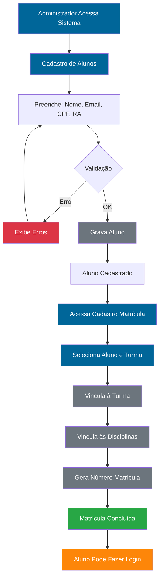

---

## FLUXO 2: CRIAÇÃO DE AULA

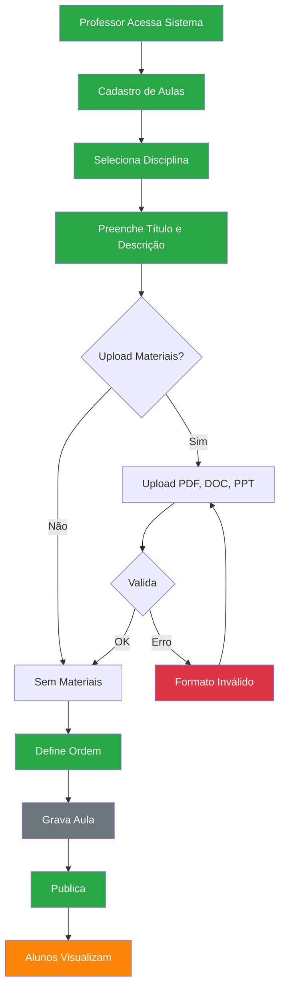

---

## FLUXO 3: CRIAÇÃO E APLICAÇÃO DE PROVA

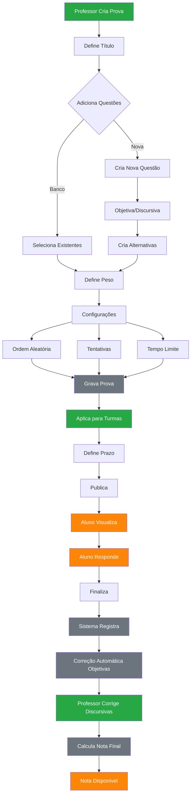

---

## FLUXO 4: ENVIO E CORREÇÃO DE ATIVIDADE

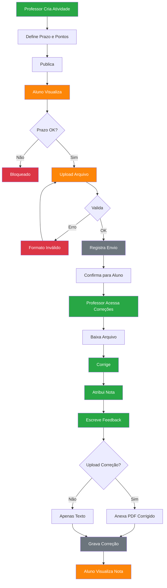

---

## FLUXO 5: REGISTRO DE FREQUÊNCIA

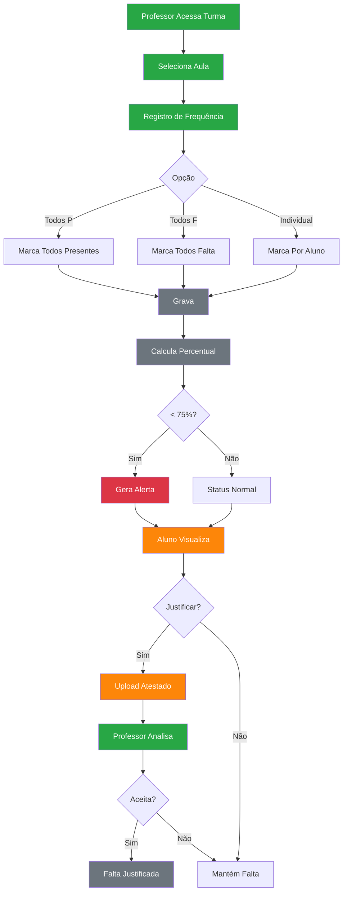

---

## FLUXO 6: SISTEMA DE MENSAGENS

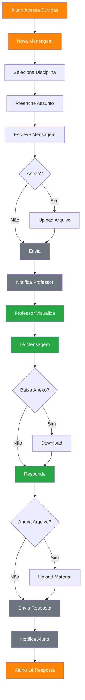

---

## FLUXO 7: PUBLICAÇÃO NO MURAL

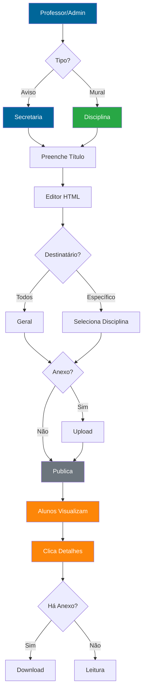

---

## FLUXO 8: FÓRUM DE DISCUSSÃO

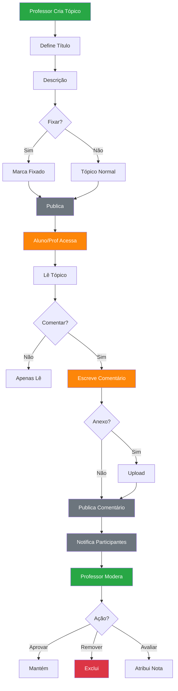

---

## FLUXO 9: ACESSO BIBLIOTECA VIRTUAL

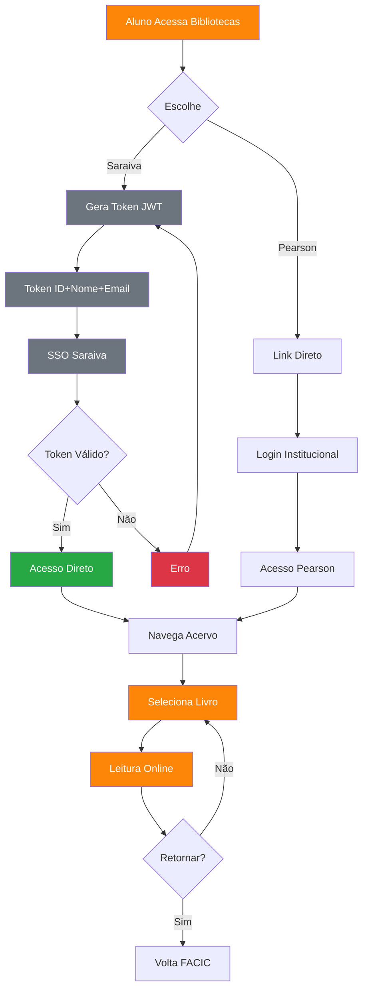

---

## FLUXO 10: UPLOAD DE VÍDEO

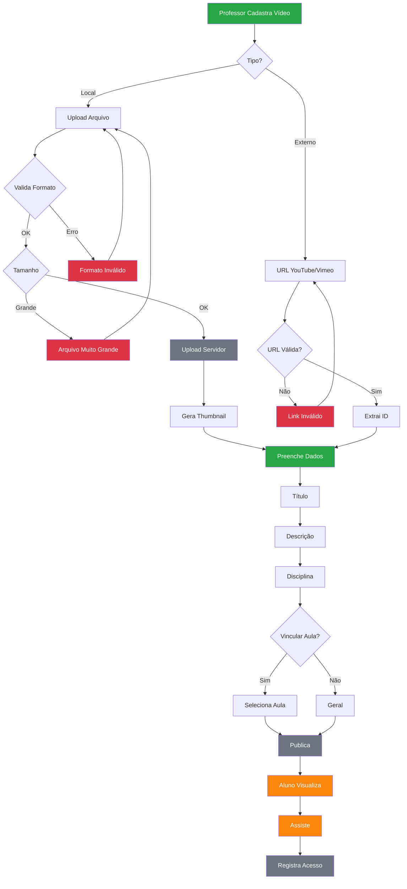

---

## FLUXO 11: GAMIFICAÇÃO - PONTOS EXTRAS

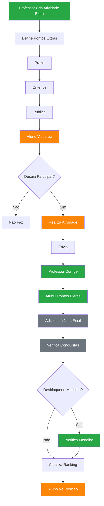

---

## FLUXO 12: GERAÇÃO DE BOLETIM

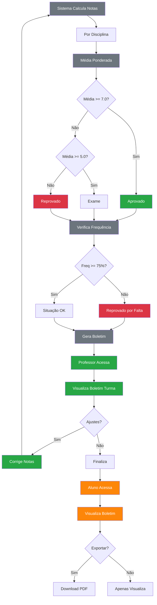

---

## 📊 RESUMO DOS FLUXOGRAMAS

| # | Fluxograma | Atores Principais | Arquivos Chave |
|---|------------|-------------------|----------------|
| 1 | Matrícula de Aluno | Admin | cadastroUsuario.php, cadastroMatricula.php |
| 2 | Criação de Aula | Professor | cadastroAula.php, gravarAula.php |
| 3 | Criação/Aplicação Prova | Professor, Aluno | cadastroProva2.php, responderQuestoes2.php |
| 4 | Envio/Correção Atividade | Professor, Aluno | cadastroAtividade.php, dadosAulas.php |
| 5 | Registro Frequência | Professor, Aluno | registrarFrequencia.php, exibirFrequencia.php |
| 6 | Sistema Mensagens | Aluno, Professor | mensagens.php, gravarMensagem.php |
| 7 | Publicação Mural | Professor/Admin, Aluno | cadastromural.php, visualizarmural.php |
| 8 | Fórum Discussão | Professor, Aluno | cadastrotopico.php, forum.php |
| 9 | Biblioteca Virtual | Aluno | bibliotecas.php, gerarTokenSaraiva.php |
| 10 | Upload Vídeo | Professor, Aluno | cadastrovideo.php, visualizarvideo.php |
| 11 | Gamificação | Professor, Aluno | cadastroExtra.php, verificarPontosExtras.php |
| 12 | Geração Boletim | Sistema, Professor, Aluno | gravarBoletim.php, exibirBoletim.php |

---

## ✅ CHECKLIST DE IMPORTAÇÃO

- [ ] Abrir Lucidchart
- [ ] Criar novo documento
- [ ] Importar Fluxo 1 (Matrícula)
- [ ] Importar Fluxo 2 (Aula)
- [ ] Importar Fluxo 3 (Prova)
- [ ] Importar Fluxo 4 (Atividade)
- [ ] Importar Fluxo 5 (Frequência)
- [ ] Importar Fluxo 6 (Mensagens)
- [ ] Importar Fluxo 7 (Mural)
- [ ] Importar Fluxo 8 (Fórum)
- [ ] Importar Fluxo 9 (Biblioteca)
- [ ] Importar Fluxo 10 (Vídeo)
- [ ] Importar Fluxo 11 (Gamificação)
- [ ] Importar Fluxo 12 (Boletim)
- [ ] Ajustar cores conforme perfis
- [ ] Adicionar legenda de cores
- [ ] Exportar como imagens
- [ ] Salvar no projeto

---

**Arquivo criado em:** 03/10/2025  
**Total de fluxogramas:** 12  
**Formato:** Mermaid (compatível com Lucidchart)  
**Status:** ✅ Pronto para importação

---

*Todos os fluxogramas estão prontos para serem importados no Lucidchart. Basta copiar e colar cada código Mermaid individualmente.*
