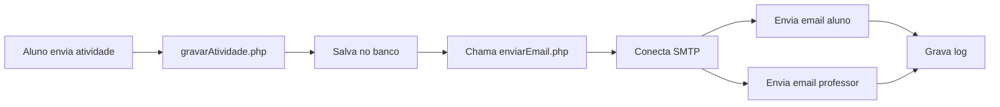
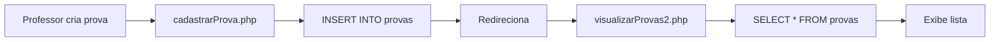

# 🎯 MAPEAMENTO: Problemas vs Testes

## Resumo Executivo

Este documento mapeia os **problemas reportados** pelos usuários aos **casos de teste automatizados** criados para diagnosticar e prevenir esses problemas.

---

## 🚨 PROBLEMA 1: Alunos Não Recebem Emails Após Envio de Atividades

### 📋 Descrição do Problema
Alunos relatam que, após enviar suas atividades através do sistema, não recebem o email de confirmação. Este é o problema mais crítico e frequente.

### 🔍 Possíveis Causas Identificadas

1. **Configuração SMTP incorreta ou incompleta**
2. **Função enviarEmail.php não está sendo chamada**
3. **Timeout no envio bloqueando o processo**
4. **Emails sendo enviados mas não gravados no banco**
5. **Servidor SMTP bloqueado ou inacessível**
6. **Email do aluno cadastrado incorretamente**
7. **Filtro de spam bloqueando emails**

### ✅ Casos de Teste Relacionados

| Teste ID | Nome do Teste | O Que Verifica | Arquivo |
|----------|---------------|----------------|---------|
| **CT-EMAIL-001** | Disparar email após envio | Se email é disparado ao enviar atividade | `alunos.spec.js` |
| **CT-EMAIL-002** | Conteúdo do email | Se email contém dados corretos | `alunos.spec.js` |
| **CT-EMAIL-003** | Disparo duplo | Se aluno E professor recebem | `alunos.spec.js` |
| **CT-EMAIL-004** | Config SMTP | Se config SMTP está correta | `alunos.spec.js` |
| **CT-EMAIL-005** | Timeout | Se envio não excede 10 segundos | `alunos.spec.js` |
| **CT-EMAIL-006** | Sem anexo | Se funciona sem arquivo | `alunos.spec.js` |
| **CT-EMAIL-007** | Arquivo grande | Se lida com arquivos grandes | `alunos.spec.js` |
| **CT-DIAG-001** | Tabela de emails | Se tabela existe e tem dados | `alunos.spec.js` |
| **CT-DIAG-002** | Config preenchida | Se config está completa | `alunos.spec.js` |
| **CT-DIAG-003** | Conexão SMTP | Se consegue conectar ao servidor | `alunos.spec.js` |

### 📂 Arquivos do Sistema Envolvidos

```
public_html/
├── enviarAtividade.php          ← Formulário de envio
├── gravarAtividade.php          ← Processa envio e chama email
└── EnvioEmail/
    ├── enviarEmail.php          ← Função principal de email
    └── Config/
        └── smtp_config.php      ← Configurações SMTP
```

### 🎯 Fluxo Esperado



### 🔧 Como Executar Testes Diagnósticos

```bash
# Executar todos os testes relacionados a emails de alunos
npm run test:alunos

# Executar apenas testes de diagnóstico
npx playwright test --grep "CT-DIAG"

# Executar apenas testes críticos
npx playwright test --grep "CRÍTICO"
```

---

## 🚨 PROBLEMA 2: Provas Não Aparecem em visualizarProvas2.php

### 📋 Descrição do Problema
Professores criam provas, mas elas não aparecem na tela de visualização. O banco confirma que a prova foi criada, mas a query não retorna os dados.

### 🔍 Possíveis Causas Identificadas

1. **Query SQL com filtro muito restritivo**
2. **Relacionamento turma/disciplina incorreto**
3. **Problema de permissão do professor**
4. **Cache do navegador**
5. **Arquivo visualizarProvas2.php com bug**

### ✅ Casos de Teste Relacionados

| Teste ID | Nome do Teste | O Que Verifica | Arquivo |
|----------|---------------|----------------|---------|
| **CT-EMAIL-PROF-011** | Prova aparece em listagem | Se prova criada aparece | `professores.spec.js` |
| **CT-EMAIL-PROF-012** | Arquivos duplicados | Qual aplicarProva está ativo | `professores.spec.js` |
| **CT-DIAG-PROF-001** | Query SQL | Se query retorna resultados | `professores.spec.js` |
| **CT-DIAG-PROF-002** | Permissões | Se professor tem acesso | `professores.spec.js` |

### 📂 Arquivos do Sistema Envolvidos

```
public_html/
├── cadastrarProva.php           ← Criação de prova
├── visualizarProvas2.php        ← Listagem (PROBLEMA AQUI)
├── aplicarProva.php            ← Aplicação (versão 1?)
└── aplicarProva2.php           ← Aplicação (versão 2?)
```

### 🎯 Fluxo Esperado



---

## 🚨 PROBLEMA 3: Questões Não Populam ao Criar Prova

### 📋 Descrição do Problema
Ao criar uma prova, o select de questões aparece vazio, mesmo havendo questões cadastradas no banco.

### 🔍 Possíveis Causas Identificadas

1. **Query filtra por disciplina e não encontra**
2. **Relacionamento questão-disciplina incorreto**
3. **Questões marcadas como inativas**
4. **JavaScript não carrega select dinamicamente**

### ✅ Casos de Teste Relacionados

| Teste ID | Nome do Teste | O Que Verifica | Arquivo |
|----------|---------------|----------------|---------|
| **CT-EMAIL-PROF-013** | Questões aparecem | Se lista tem questões | `professores.spec.js` |
| **CT-EMAIL-PROF-014** | Turmas aparecem | Se lista tem turmas | `professores.spec.js` |

---

## 🚨 PROBLEMA 4: Arquivos Duplicados (aplicarProva.php vs aplicarProva2.php)

### 📋 Descrição do Problema
Existem dois arquivos similares e não está claro qual está sendo usado pelo sistema.

### 🔍 Possíveis Causas

1. **Refatoração incompleta**
2. **Versões antigas não removidas**
3. **Links apontando para arquivos diferentes**

### ✅ Casos de Teste Relacionados

| Teste ID | Nome do Teste | O Que Verifica | Arquivo |
|----------|---------------|----------------|---------|
| **CT-EMAIL-PROF-012** | Arquivos duplicados | Qual está ativo | `professores.spec.js` |

---

## 📊 Matriz de Rastreabilidade

### Por Prioridade

| Prioridade | Problema | Testes |
|------------|----------|--------|
| 🔴 **CRÍTICA** | Emails não recebidos | CT-EMAIL-001 a 007 |
| 🔴 **CRÍTICA** | Provas não aparecem | CT-EMAIL-PROF-011, 013, 014 |
| 🟡 **ALTA** | Configuração SMTP | CT-EMAIL-ADM-024 |
| 🟡 **ALTA** | Questões não carregam | CT-EMAIL-PROF-013 |
| 🟢 **MÉDIA** | Arquivos duplicados | CT-EMAIL-PROF-012 |

### Por Módulo

| Módulo | Testes | Status |
|--------|--------|--------|
| Envio de Atividades | 10 testes | ✅ Implementados |
| Criação de Provas | 5 testes | ✅ Implementados |
| Configuração SMTP | 4 testes | ✅ Implementados |
| Diagnóstico | 7 testes | ✅ Implementados |

---

## 🔄 Processo de Investigação

### Passo 1: Executar Testes Iniciais

```bash
# Rodar todos os testes críticos
npx playwright test --grep "CRÍTICO"
```

### Passo 2: Analisar Falhas

```bash
# Ver relatório detalhado
npm run report
```

### Passo 3: Testes Específicos

```bash
# Se emails falharam
npm run test:alunos

# Se provas falharam
npm run test:professores
```

### Passo 4: Diagnóstico Profundo

```bash
# Testes de diagnóstico
npx playwright test --grep "CT-DIAG"
```

---

## 📈 KPIs e Métricas

### Testes Devem Validar

- ✅ **Taxa de entrega de emails** > 95%
- ✅ **Tempo de envio** < 10 segundos
- ✅ **Provas criadas aparecem** = 100%
- ✅ **Questões disponíveis** > 0
- ✅ **Conexão SMTP** = Sucesso

---

## 🎯 Próximos Passos

1. ✅ Testes criados e documentados
2. ⏳ Executar primeira bateria de testes
3. ⏳ Analisar resultados
4. ⏳ Corrigir problemas identificados
5. ⏳ Re-executar testes
6. ⏳ Documentar soluções

---

**Documento criado em:** Outubro 2025  
**Última atualização:** Outubro 2025  
**Versão:** 1.0
